# Reappear & Think

Source file Readme-raw.md

Purpose: Reproduce the realization, feel the effect; understand the algorithm process, analyze the algorithm bottleneck; learn from the ideas, try to improve the method;


## 1. Environment & Configuration

**surroundings**

```
$ pip list | grep torch
torch               1.1.0
torchvision         0.3.0

$ pip install tensorboardX
```

**Modify the code cp_dataset.py**

Transform the single-channel graph in the source code, which needs to be modified.

```
Traceback (most recent call last):
  File "train.py", line 191, in <module>
    main()
  File "train.py", line 176, in main
    train_gmm(opt, train_loader, model, board)
  File "train.py", line 58, in train_gmm
    inputs = train_loader.next_batch()
  File "/vton/cinastanbean-cp-vton/cp_dataset.py", line 166, in next_batch
...
    tensor.sub_(mean[:, None, None]).div_(std[:, None, None])
RuntimeError: output with shape [1, 256, 192] doesn't match the broadcast shape [3, 256, 192]

```

```python
self.transform = transforms.Compose([  \
        transforms.ToTensor(),   \
        transforms.Normalize((0.5, 0.5, 0.5), (0.5, 0.5, 0.5))])
self.transform_1d = transforms.Compose([ \
        transforms.ToTensor(), \
        transforms.Normalize((0.5,), (0.5,))])
```

**--workers 4 --> --workers 0**

```
ERROR: Unexpected bus error encountered in worker. This might be caused by insufficient shared memory (shm).
...
RuntimeError: DataLoader worker (pid 2841) is killed by signal: Bus error.
```


## 2. Train


**STEPS**

```
step1-train-gmm.sh
step2-test-gmm.sh
step3-generate-tom-data.sh
$ mv result/gmm_final.pth/train/* data/train/
step4-train-tom.sh
step5-test-tom.sh
```
The graphics card memory uses 2647MiB (Memory-Usage), which is limited to generating an image size of 256x192; training time, ordinary single-card machine can be completed in 1-2 days.

Train the model according to the original author's default parameters. The training model is stored in Baidu network disk (link: https://pan.baidu.com/s/1gJqjGvXQgdoGkCF_YpNAUQ extraction code: b3fk) for download and test. The tensorboard file is about 19G, if you need a limited time, you can contact to obtain it.

```
Hi, according to the original author's default parameters, I reproduced an experiment.
The training model is stored in Baidu network disk (link: https://pan.baidu.com/s/1h6h9MYswltN4mcp5dfYycg extraction code: uwgg) for download and testing.
Part of the analysis and humble opinion is written on Github: https://github.com/cinastanbean/cp-vton.
```


```
$ tree checkpoints/
checkpoints/
├── gmm_train_new
│   ├── gmm_final.pth
│   ├── step_005000.pth
│   ├── ...
│   └── step_200000.pth
└── tom_train_new
    ├── step_005000.pth
    ├── ...
    ├── step_200000.pth
    └── tom_final.pth
```

**TensorBoard**

```
tensorboard/
├── gmm_train_new
│   └── events.out.tfevents.1568110598.tplustf-imagealgo-50529-ever-chief-0
├── gmm_traintest_new
│   └── events.out.tfevents.1568185067.tplustf-imagealgo-50529-ever-chief-0
├── tom_test_new
│   └── events.out.tfevents.1568473618.tplustf-imagealgo-50529-ever-chief-0
└── tom_train_new
    └── events.out.tfevents.1568188644.tplustf-imagealgo-50529-ever-chief-0
    
$ tensorboard --logdir tensorboard/gmm_train_new/
$ tensorboard --logdir tensorboard/gmm_traintest_new/
$ tensorboard --logdir tensorboard/tom_train_new/
$ tensorboard --logdir tensorboard/tom_test_new/
```

web: 

	http://everdemacbook-pro.local:6006/#scalars
	http://everdemacbook-pro.local:6006/#images

scalars / images :

	gmm_train_new

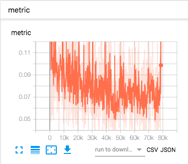
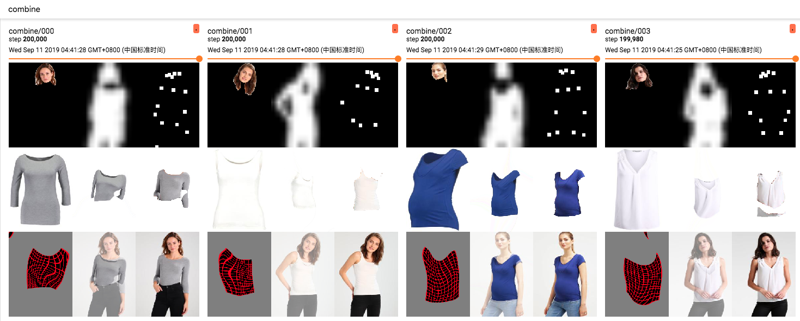

	gmm_traintest_new

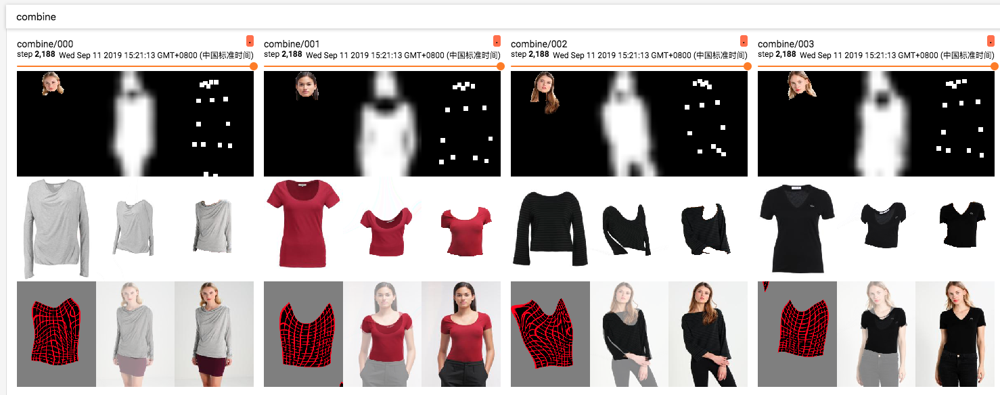

	tom_train__new

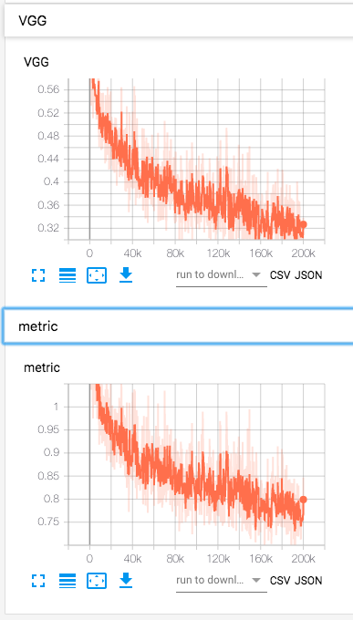  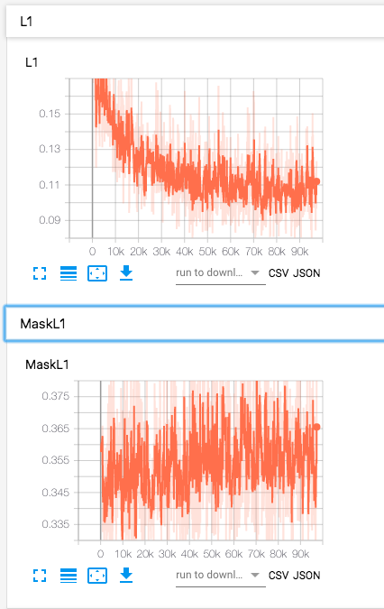
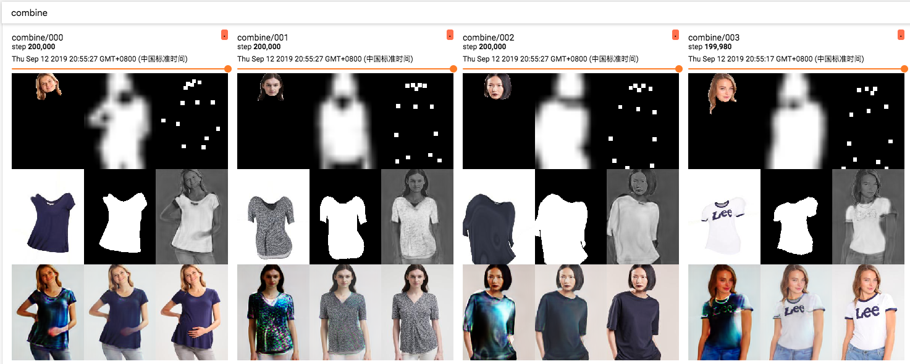

	tom_test_new

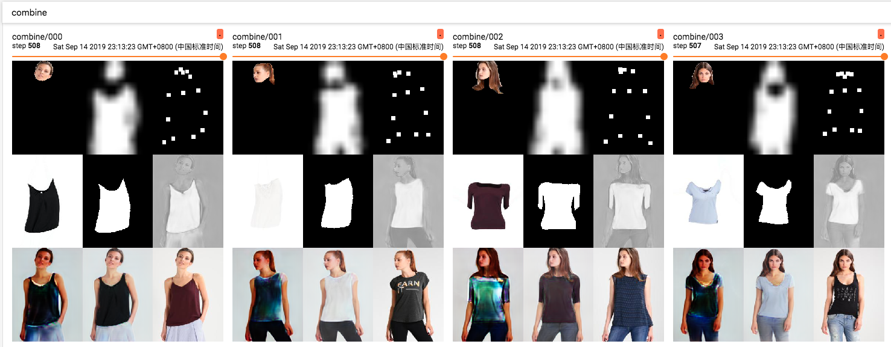


## 3. Test

Perform the steps listed in the STEPs before and after the execution ``python smart_show_test_result.py```，You can view the generated results in the folder```result_simple```，The sample pictures are as follows. From left to right, each column of pictures means:

[cloth, cloth-mask, model-image, model-image-parse, cloth-warp, cloth-warp-mask, try-on-result]

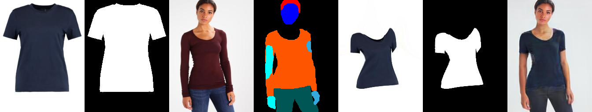
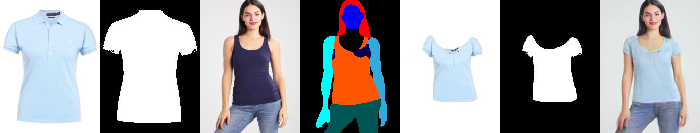
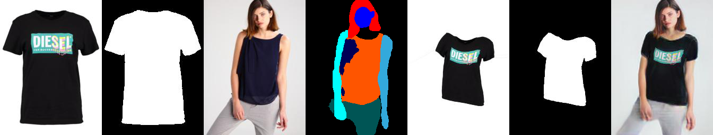
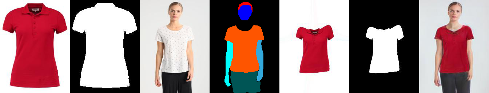
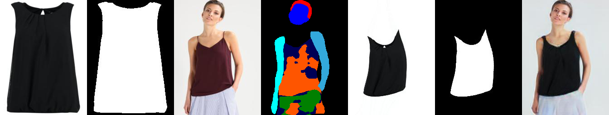
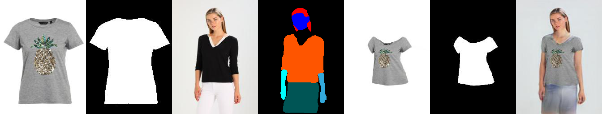
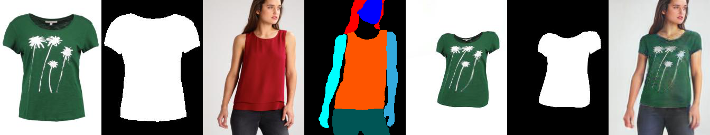
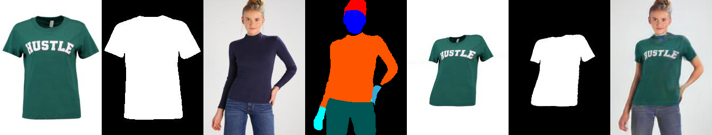
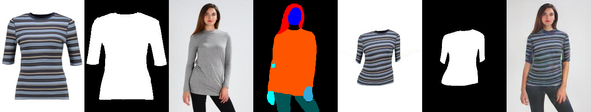


## 4. Bottleneck of Virtual Try-On technology route

Virtual model image generation is technically achieved in three ways.

"Virtual Try-On" (VTON) is one of them.


**VTON technology has the following considerations:**

1. To avoid the problem of model generation, the model generation itself is more difficult to achieve, and it is difficult to achieve fidelity to the model's face, hair, and body authenticity. The VTON technical route circumvents this problem;
2. The default model is already wearing clothing that is roughly the same size and shape as the clothing to be synthesized. Warping the clothing and then "sticking" the texture to achieve the Try-On effect.


**There are still some problems with the technical productization of VTON:**

 1. For the designated model, give him another set of clothes, the copyright issue needs to be properly handled;
 2. How to maintain visual coordination in the matching of clothing and people;
 3. The natural deformation of clothing when it is worn on people, because doing Warping on clothing does not fundamentally solve the problem of understanding clothing; (striped clothing as shown below)
 4. The model poses in a variety of poses, and the occlusion problem between the limbs and the clothing; (the arm shields the clothing as shown below)
 5. Current data and experiments, the data is limited to the short-sleeved shirt category, the image size is 256x192, and it is also a Toy-level experiment;

**Striped clothing**

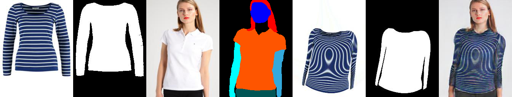
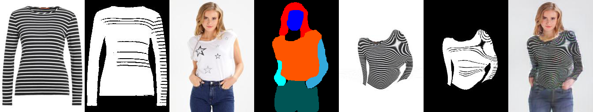
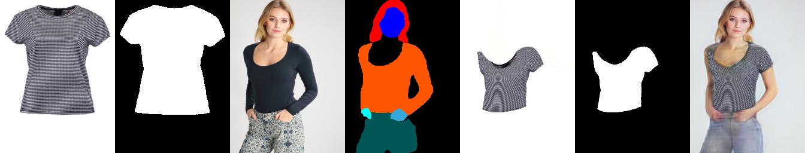

**Arm covering clothing**
 
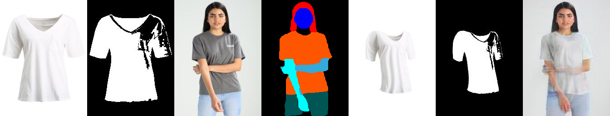
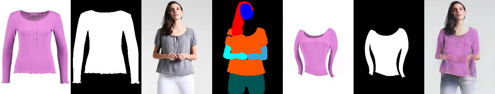
 
 
## 5. Algorithm evolution direction

**Virtual Try-on**

To pay tribute to your creativity, this road still has many technical points to solve.


```
.
├── 2017-VITON-MalongTech
│   ├── 1705.09368.Pose Guided Person Image Generation.pdf
│   ├── 1711.08447.VITON- An Image-based Virtual Try-on Network.pdf
│   ├── 1902.01096.Compatible and Diverse Fashion Image Inpainting.pdf
│   └── 2002-TPAMI-Shape matching and object recognition using shape contexts.pdf
├── 2018-CP-VTON-SenseTime
│   └── 1807.07688.Toward Characteristic-Preserving Image-based Virtual Try-On Network.pdf
├── 2019-Multi-pose Guided Virtual Try-on Network (MG-VTON)
│   └── 1902.11026.Towards Multi-pose Guided Virtual Try-on Network.pdf
├── 2019-WUTON
│   └── 1906.01347.End-to-End Learning of Geometric Deformations of Feature Maps for Virtual Try-On.pdf 
```

